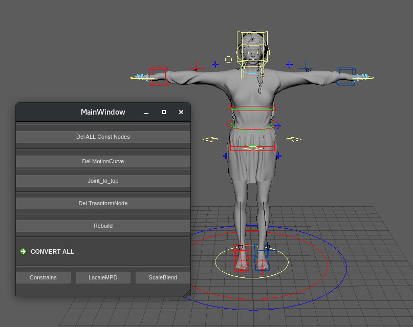
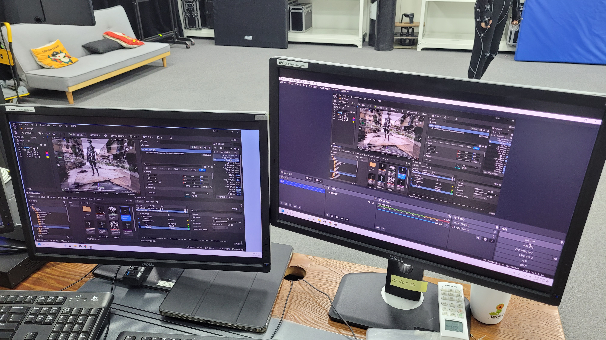

# Before Mocap 
## 촬영전에는 이런 준비를 해왔습니다.



툴에 들어갈 어셋을 리타겟하기 용이하도록, 스크립트를 제작하여 단숨에 T-pose로 만들어줍니다.
필요에 의해 RIG를 지우고, model과 joint만 남겨둬도 메시가 찢어지지 않도록 주의합니다.

---



언리얼 환경에 프리뷰용 어셋들을 세팅합니다. 이후 레퍼런스 캠이나 프랍 등, 촬영에 추가적인 도움이 될 요소들을 사전준비합니다.

<!--more-->

* toc
{:toc .large-only}

If you prefer the old Twitter logo, you can use it through `twitter-old`.
{:.note.smaller}

There are also many new social media networks, some of which are now included by default:

| Name | Icon | Name | Icon |
|:-----|------|:-----|------|
| signal | <span class="larger icon-signal"></span> | threads | <span class="larger icon-threads"></span> |
| playstation | <span class="larger icon-playstation"></span> | messenger | <span class="larger icon-messenger"></span> |
| stripe | <span class="larger icon-stripe"></span> | slack | <span class="larger icon-slack"></span> |
| gitlab | <span class="larger icon-gitlab"></span> | line | <span class="larger icon-line"></span> |
| medium | <span class="larger icon-medium"></span> | xbox | <span class="larger icon-xbox"></span> |
| wechat | <span class="larger icon-wechat"></span> | discord | <span class="larger icon-discord"></span> |
| mastodon | <span class="larger icon-mastodon"></span> | twitter | <span class="larger icon-twitter"></span> |

If your perferred network is missing, note that you can always [follow the steps to add custom icons](../../docs/advanced.md#adding-a-custom-social-media-icon) from the docs, which is what I did for this release.


## Dark Mode is Now Free
When I first added dark mode to Hydejack it was still considered a novelty. 
Unity, a popular game engine, was limiting dark mode to its paid version at the time --- a model that I've adopted for Hydejack. 
Today, dark mode is considered a minimal requirement for any new theme and to reflect that reality, 
starting with Hydejack 9.2, dark mode is included in all versions of Hydejack. 


## Updated Docs
The documentation has been updated with a focus on deployment via GitHub Actions and CI pipelines. 
I've added a chapter on how to [Deploy](../../docs/deploy.md){:.heading.flip-title} and updated many of the existing chapters.

The deployment experience for __PRO customers__ has also been improved. You are now automatically added to a "PRO Customers" team on GitHub if you provide a GitHub username during checkout (existing customers can request an invite through [mail@hydejack.com](mailto:mail@hydejack.com)).
Members of this team have read access to the pro repository, which allows the theme to be fetched during a CI run. 
For detail, check out the new [Deploy](../../docs/deploy.md){:.heading.flip-title} chapter.


## Google Fonts Off by Default
Google Fonts are now turned off by default in the starter kits, but remain in use on hydejack.com for visual continuity. All associated options continue to work as they did before. Only new users have to enable them in the config file if they want to match the look of hydejack.com.

The reason for this change is that sensibilities around privacy have changed in recent years. 
No Google product feels appropriate as a default option for an ownership and self-hosting oriented product like Hydejack.

To restore the old look that matches hydejack.com, add the following to your `_config.yml` file:

```yml
google_fonts:          Roboto+Slab:700|Noto+Sans:400,400i,700,700i
font:                  Noto Sans, Helvetica, Arial, sans-serif
font_heading:          Roboto Slab, Helvetica, Arial, sans-serif
```

On a related note, I've also decided against updating the included Google Analytics script, in part because the upgrade path is incomprehensible, but also due the the same privacy concerns that make Google Fonts a bad default option. I recommend independent analytics services like 
[Plausible](https://plausible.io), [Matomo](https://matomo.org/) or maybe even [Counterscale](https://counterscale.dev) (if you are a Cloudflare customer).
You can include the tracking scripts by [adding them as custom HTML](../../docs/basics.md#adding-custom-html-to-the-head).

