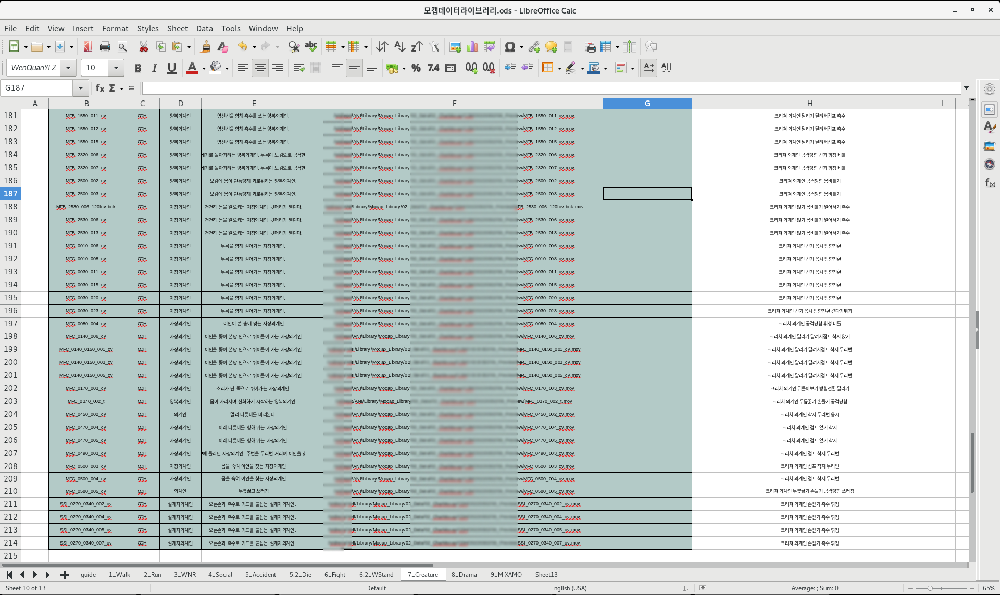

# to Animation
  >애니메이터가 모션을 손쉽게 검색하고 원하는만큼 편하게 사용하는, 모션 라이브러리를 만들었습니다.  
{:.note.smaller}
## Motion List

클린업, FBX or Anim데이터 익스포트, 프리뷰 작업까지 완료된 데이터들을 리스트로 정리합니다.  

모션 데이터들을 내용에 따라 크게 걷기/뛰기/싸우기/크리쳐 등의 항목으로 분류, 저장해줍니다.  
이후 모션의 내용, 데이터 경로, 태그를 붙여, 데이터를 검색하기 쉽도록 분류했습니다.  

<!--more-->
---
## Motion Library

위에 정리해둔 데이터들을 maya에서 불러오고, 프리뷰를 통해 모션을 볼 수 있도록 했습니다.  
애니메이터는 태그를 통해 모션을 검색하고, 원하는 만큼 구간을 지정해서 데이터를 임포트하는것도 가능합니다.

추가적으로, 사용자가 원하는 부분 (ex. 손, 팔, 상체 등)만 지정해서 따로 임포트 하는 기능과
좌우 반전되어 임포트 되는 기능 등도 구현되어있습니다.

자세한 사용방법은 사진을 클릭해주세요! (유튜브 링크로 이어집니다.)

---

* toc
{:toc .large-only}
