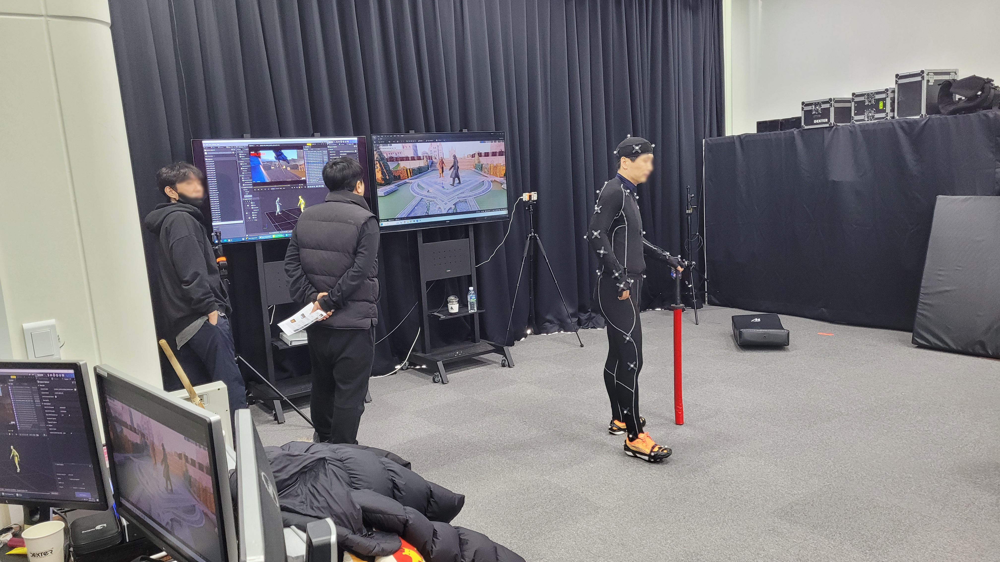
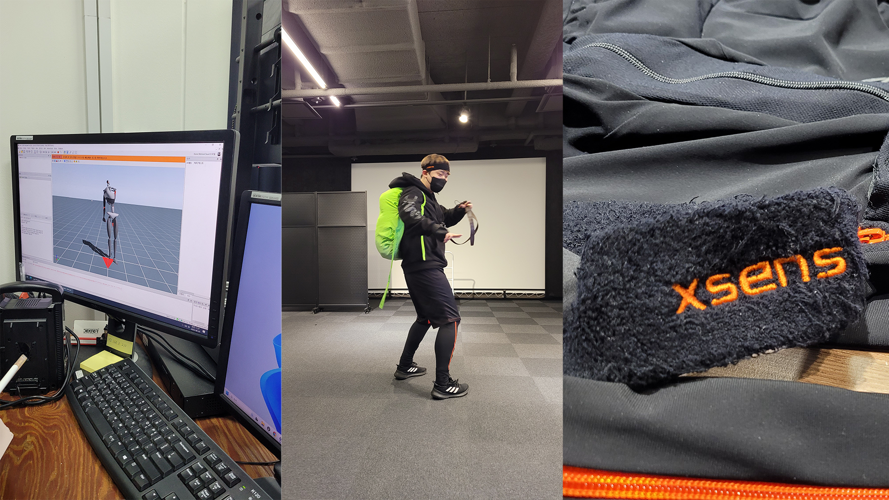
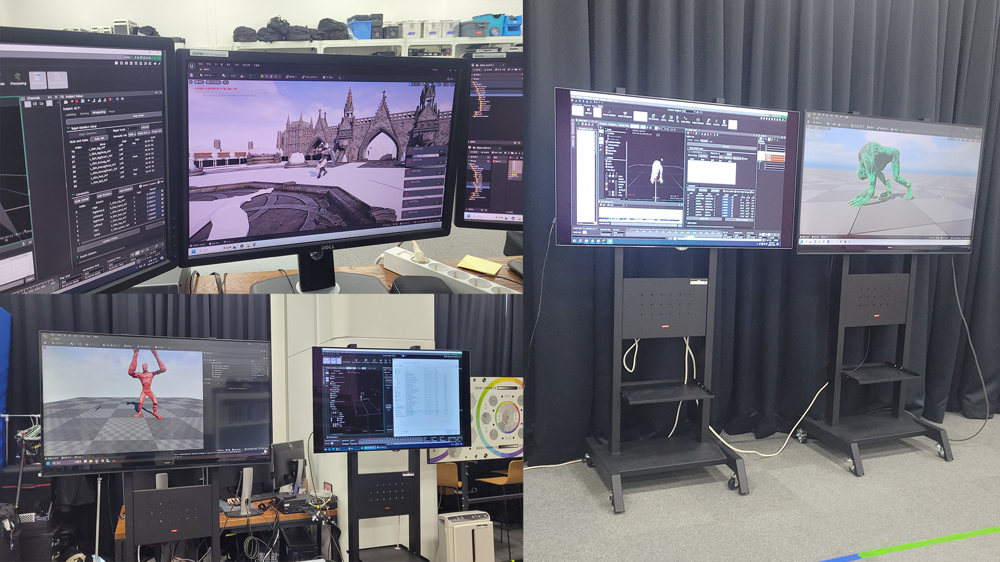
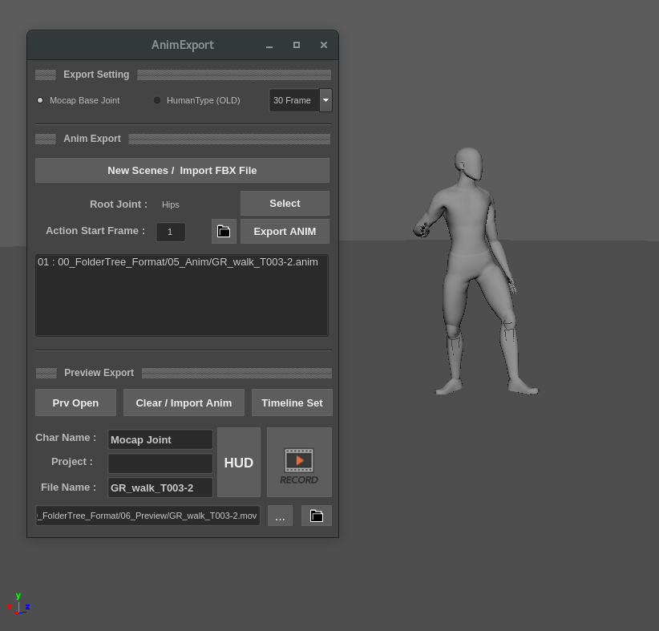
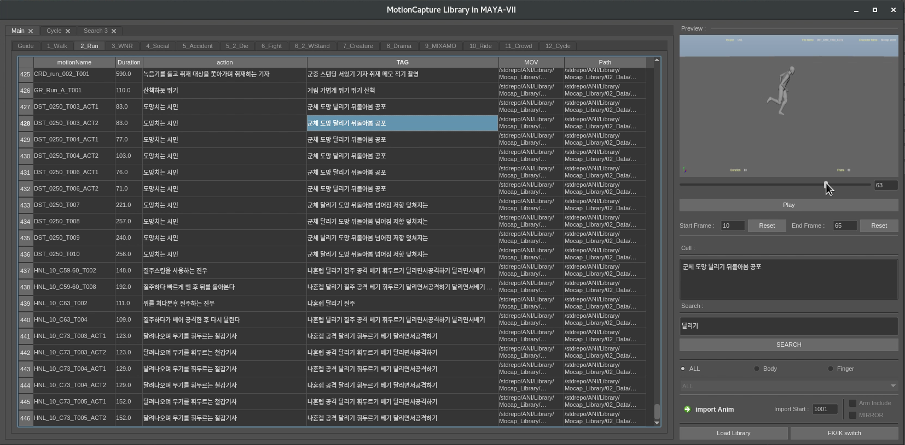

##
# MotionCapture Operator

>모션캡쳐에 사용한 프로그램 소개 

1. Vicon Shogun Live & Post

  

 
현재 제일 메인으로 사용하는 광학식 모션캡쳐 시스템입니다.  

여러대의 카메라가 동시에 마커를 촬영하고, 마커의 위치값을 통해 조인트의 위치를 계산합니다.  

카메라의 갯수가 많을수록 고품질의 데이터를 얻을 수 있다는 장점이 있습니다.

2. Xsens  

  

 

자이로 센서를 부착한 수트를 입고 촬영하는 모션캡쳐 시스템입니다.  
야외촬영 및, 세트장과 같은 다른 공간에서의 상호작용에 용이하다는 장점이 있습니다. 
 

3. Unreal Engine5 LiveLink  

  

 

프리뷰를 위해 사용하는 툴입니다. 기본적인 라이팅도 세팅이 되어있어서,  
언리얼 시퀀서를 통해 애니메이터가 배정받은 샷의 카메라무브를 재연할 수 있고,  
애니메이터는 보다 직관적으로 현재 촬영중인 데이터가 자신의 작업물에 어떻게 사용될지 미리 체크하고,
계획 및 디렉팅에도 용이합니다. 
 

4. Motion Builder
 

모션빌더 역시 프리뷰를 위해 사용될 수 있습니다. 또한, Xsens 와 같은 FBX데이터의 처리에 있어,  
 HumanIK시스템으로 컨트롤러를 일시적으로 부여해준 후 클린업 작업까지 수행합니다.
 

5. Maya  

  
 

FBX, anim의 형태로 컨버팅하여 애니메이터가 사용하기 편하게 전달합니다.

---
상기한 일련의 과정들을 팀원들과 함께 고찰하여, 가장 사용하기 편리한 형태의 [클린업 파이프라인]()을 완성했습니다.

또한, [액팅 및 오퍼레이팅 과정에서부터 어떻게하면 깔끔하고 좋은 데이터를 얻을 수 있을지]() 고민했습니다.
 

# Facial Capture

1. Metahuman Animator

메타휴먼 애니메이터를 통해 iPhone 동영상을 촬영, 고품질의 페이셜 데이터를 얻을 수 있습니다.  
메타휴먼 페이셜 리그에 직접 집어넣고, 애니메이터가 사용하기 용이하도록 전달합니다.

2. Dynamixyz

Depth 촬영 기능이 있는 카메라를 헤드마운트에 얹어서 촬영하는 방식입니다.  
직접 매치메이션을 해주고, 얼굴의 마커를 인식시켜준 뒤 값을 가져옵니다.  
iPhone보다 가볍다는 장점이 있지만, 사전작업이 까다로운 편입니다.

# Animation

1. 라이브러리를 통한 Mocap 데이터 추출

   

모션캡쳐 라이브러리를 통해, 애니메이션 과정에 있어 작업자가 번거롭게 여러 툴 오갈 필요 없이,  
Maya 하나만으로 데이터 프리뷰를 확인, 임포트 후 리타겟과정까지 자동으로 진행하는 툴을 개발했습니다.

자세한건 [여기]()서 확인해주세요!
