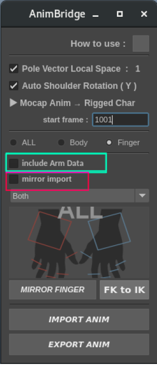
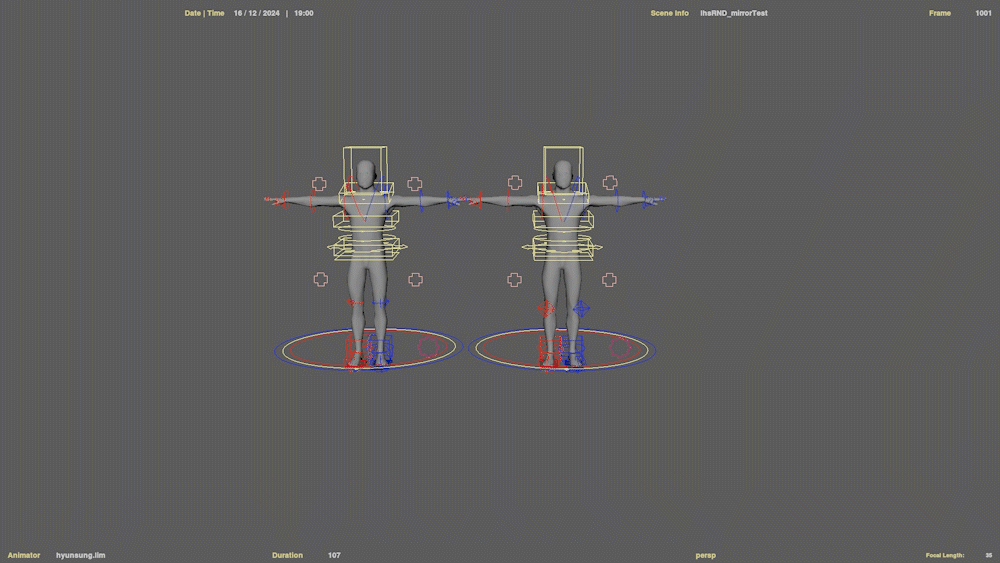
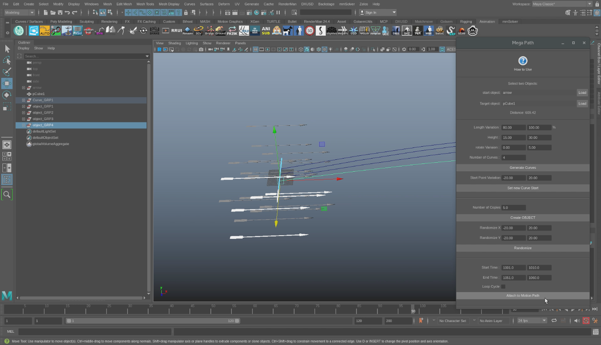
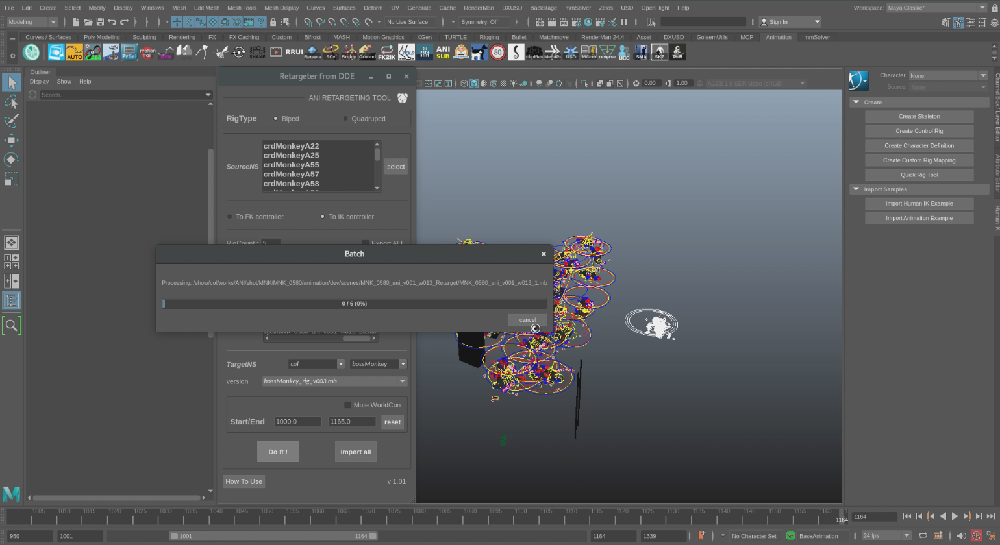
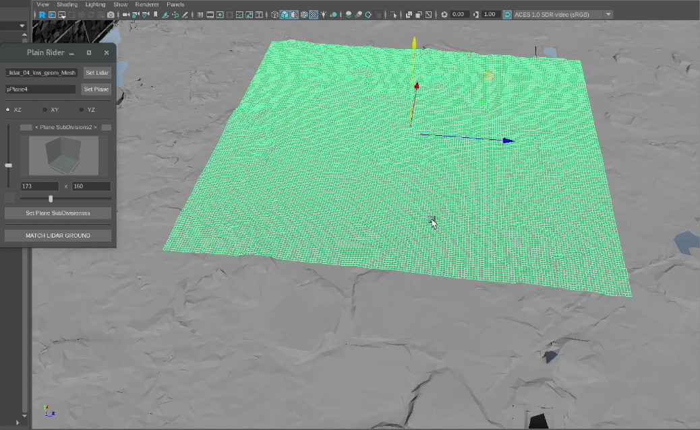
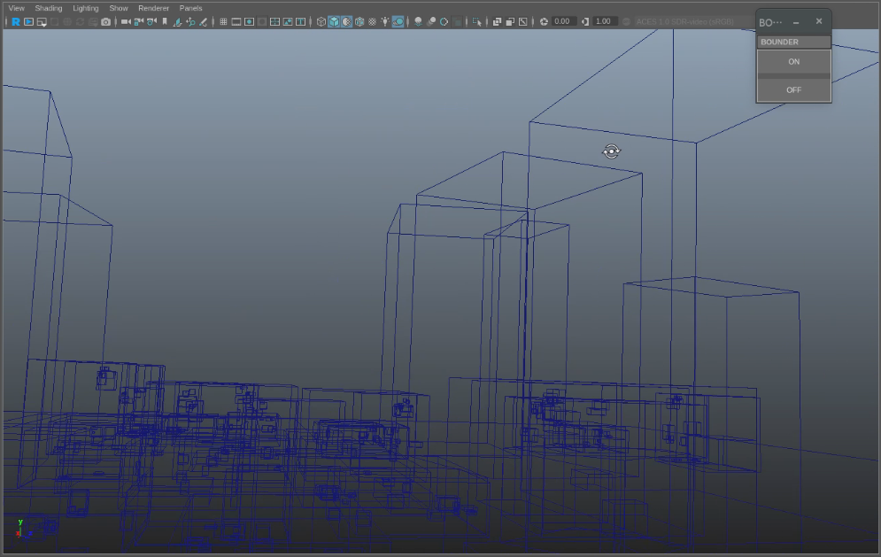
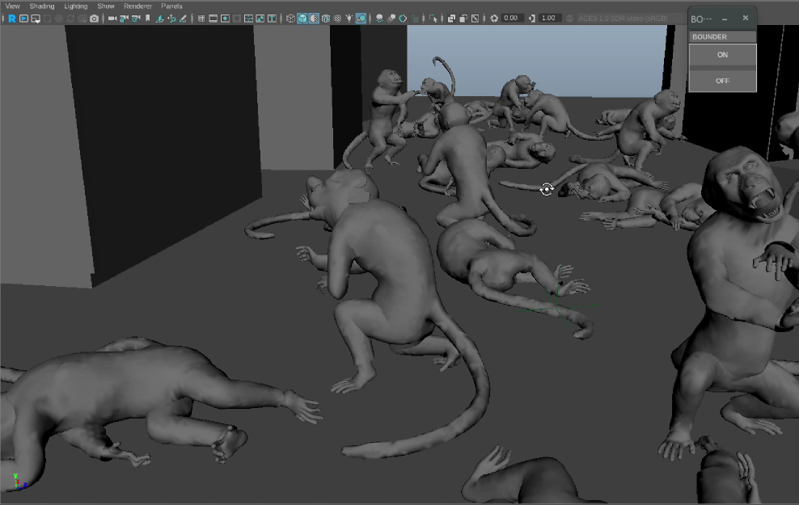

## 애니메이터를 위한 툴 제작

애니메이션 작업을 보다 효율적으로 하기위해서는, 애니메이터의 감각도 중요하지만  
때로는 단순한 반복작업을 이루어주거나, 사전작업의 간소화 등을 통해 애니메이션 외의 작업에 있어서  
시간을 많이 소요하지 않는것이 중요합니다.

이를 최우선으로 생각하여, 애니메이터들이 보다 나은환경에서 작업 할 수 있도록  

스크립트 및 툴 RND를 통해 서포트 해왔습니다.

---
### - 모션 데이터의 자유로운 사용

---

애니메이터들이 가장 아쉬워 한 것중 하나가, 전신이 보이지 않는 샷의 작업시,  
모션캡쳐 데이터의 "일부 부위만" 사용하고싶으나, 리그가 무거운 경우 리그 내부의 키를 일일히 지워줘야 된다는 문제가 발생했습니다.

이에 임포트시 모션데이터를 팔, 손, 상체 등 원하는부위만 선택해서 임포트하는 기능을 추가했습니다.

추가로, 왼손의 모션이 마음에들어서 불러온 뒤, 오른손으로 미러 작업을 해주는 과정이 번거롭다는 의견도 들어,  
 

 
좌우반전 임포트 기능도 추가했습니다.

---

### - 대용량 오브젝트 발사 전용 툴

대규모 전쟁씬이 있는 프로젝트에서, 화살이나 투석기를 이용한 투척 등, 포물선운동을 하는 오브젝트들이  
뒤에 배경으로 깔려야하는 샷이 있었습니다.  

이 작업을 전부 FX로 처리하기엔, 해당 파트에게 부담을 심하게 줄 뿐만 아니라, 무거워서 효율이 떨어진다는 의견이 있어,

RIG로 만들어진 오브젝트의 리깅을 제거하고 불러와, 해당 오브젝트를 복사, 그룹화, 랜덤값 부여 등으로 자연스럽게 배치해줍니다.

이후 커브값을 랜덤하게 생성해 오브젝트 그룹마다 해당 커브를 한개씩 따라가는 모션패스를 생성하여, 자연스러운 대규모 발사 씬이 만들어 질 수 있도록 서포트 했습니다.

---

### - 대규모 리타게팅 전용 툴

한 샷에, 캐릭터 하나하나가 다른 움직임을 하고있는 리그가 대략 100여마리 들어가있는 씬을 작업해야 했습니다.

해당 샷을 애니메이팅하던 도중, 애니메이션의 컨셉은 유지하되 캐릭터의 컨셉이 크게 바뀌어, 크기나 팔 길이 등이 변경되는 일이 있었습니다.

그 과정에서 발생한 문제인

1. 샷이 압도적으로 무거워서 리타겟팅을 동시에 걸면 MAYA가 꺼짐.
2. 한마리한마리 리타게팅을 해주게되면 크기차이때문에 위치값이 망가지는 문제가 발생.

 현상을 해결해야 했습니다.

이에 저는 리그를 원점으로 돌리고, 크기를 서로 맞춰준 뒤에 리타겟, 이후 리깅이 원래 있던자리로 되돌아 간 뒤에, 크기를 새 리그에 맞춰서 돌려주는 방법을 택했습니다.

그리고 리그를 각각 5~10개씩 나눠서 씬을 -batch모드로 돌려, 안정적으로 리타겟이 가능하도록 툴을 제작하여 서포트했습니다.

---

### - 복잡한 배경데이터의 바닥면을 추출하는 툴

VFX에서는 배경을 LIDAR 라는 시스템을 이용하여, 촬영 세트장을 직접 스캔해서 사용하는 방식을 취합니다.

해당 방식은 데이터가 무겁고, 3D 스캔 특성상 메쉬의 버텍스가 생각만큼 깔끔하지 않다는 단점이 있습니다.

이에 Plane을 깔고 subdivision을 촘촘하게 올려, 그 plane과 가장 가까운 Y값의 오브젝트를 계산해 해당 메쉬의 면에 달라붙는 툴을 개발했습니다.

이후 라이팅과정에서 깔끔한 바닥이 필요하게 되어, 해당 툴을 사용하여 후반파트에 배경까지 같이 넘겨주는것이 정식 파이프라인으로 자리잡았습니다.

---

### - 무거운 샷의 카메라 전환을 위해 바운드박스로 토글

마찬가지로 무거운샷의 경량화작업을 위한 툴입니다.  
ON버튼을 누르면 드래그나 휠업 등으로 카메라를 전환할때, 바운드박스로 바뀌게되어 중간값을 렌더하지않습니다.

---

### - 그 외

그 외, 사내 규약과 전혀 다른 리그를 외주사에서 전달받았을때의 모캡데이터 임포트 담당이나,  
캐시데이터나 스크립트의 오류 발생시 문제해결, 단순 문서화 작업부터 복잡한 파이프라인의 업데이트 등,   

애니 작업에 있어 더 나은 데이터 전달과 편리한 애니메이팅을 위해 끊임없이 RND해왔습니다.

새로운 환경에서 배워나갈점이 있다면, 두려워한다기 보다 우선 들여다보기를 좋아합니다.

팀원 및 다른 작업자들께 도움이되는 툴을 만들어 서포트하는것이, 제 일에서의 가장 큰 보람입니다.