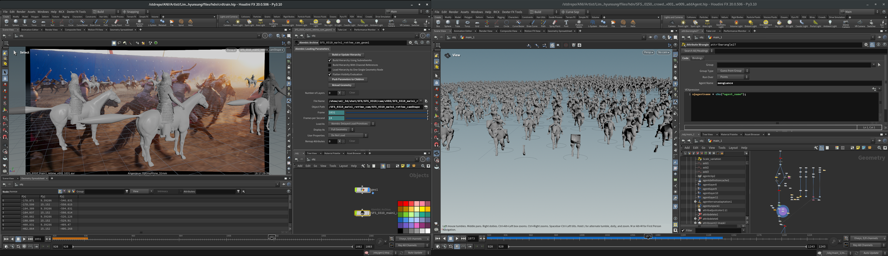

##
# Crowd Simulation

> 모션 데이터를 블렌딩하여, 상황에 맞는 적절한 군중 애니메이션 레이아웃을 배치.

## Houdini

  

> 사조영웅전 : 협지대자[2025]

 
애니메이션과 모션캡쳐 데이터를 적절히 조합해, 캐릭터의 모션을 만들어냅니다.  

다양한 동작 배리에이션이 완성되었다면, 군중 어셋을 필드에 배치합니다.

## 자유로운 군중 제어
 

이런식으로, 오브젝트나 VEX 스크립트를 통해 군중 파티클들의 진행방향이나 형태, 속도 등을 정해줄 수 있습니다.  
위와같은 형태는 물고기 군중작업 당시 사용한 설정입니다.

 
 

## Crowd Scene

 

> 드라마 북극성

 
 

> COLONY

 
 

> Project : GYERIM
 