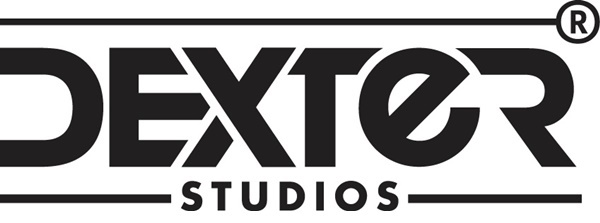

## I AM...

> *#**MotionCapture Artist** , #**Crowd Artist** , #**Animation TA** , #**Animation Pipeline*** , #**Animatior**
-  안녕하세요! 모션캡쳐 및 군중 시뮬레이션과, 3D 애니메이션 파트 전문 VFX 테크니컬 아티스트로 활동하고있습니다.  
Hello! I am work in MoCap Artist, Crowd Simulation artist, VFX pipeline TA and 3D animation TA .

## 주요 경력
-  [Dexter Studios](https://dexterstudios.com/ko/)
   - [ **2022. 12. 19** ~ 재직 ] | 제작 1부 애니메이션 2실 4팀 : 모션캡쳐, 군중 및 애니메이션 전반 기술작업 담당

-  [Digital Hearts (일본)](https://www.digitalhearts-hd.com/)
   - [ **2019. 08 ~ 2020. 06** ]   |  한국어 로컬라이징 LQA 및 게임플레이 FQA 담당, 일본

##  핵심 역량

**모션캡쳐 아티스트 (Motion Capture Artist)**
  -  Vicon, Xsens 등을 통한 전반적인 모션캡쳐 오퍼레이팅
  -  motionBuilder, vicon 을 통한 데이터 클린업
  - Unreal livelink 를 통한 실시간 프리뷰
  - Meta Human을 통한 페이셜 데이터 캡쳐
  - 사용자가 사용하기 편리하도록 모션 데이터를 FBX, anim, .mb 등의 형식으로 나누어 관리

**군중 시뮬레이션 아티스트 (Crowd Simulation Artist)**
  - Houdini의 Agent 시스템을 이용한 군중 시뮬레이션
  - 단순한 배치를 넘어, 물체 간의 간섭이나 군중 에이전트 간의 상호작용까지

**애니메이션 TA (animation Technical Artist)**
  - Python, bash 등을 통한 전반적인 애니메이션 파트 전후 파이프라인 관리
  - MayaCmds, MayaMEL, HoudiniVEX 등을 이용, 작업자에게 필요한 반복적 혹은 복잡한 과정을 툴을 만들어 자동화
  - 그 외 애니메이션, 리깅, 라이팅 작업자들 간의 기술적 문제 발생시 조율 및 해결

**3D 애니메이터 (3D Animatior)**
  - 모션캡쳐 데이터를 에디팅해, 주어진 상황이나 카메라 등에 맞춰 애니메이션 제작
  - 키 애니메이션을 통해, 인간 외의 생물이나 기계 등의 애니메이션 제작

### Main Stacks

| Type | Tool | 비고 |
|------|------|--------|
| Animation & Crowd | Maya, Houdini, motionBuilder 등 |  |
| Motion Capture | Vicon shogun, Xsens, UnrealEngine, DynamicXYZ 등 | 페이셜에 UE메타휴먼, Dxyz 사용 |
| TA |  Python, Linux bash 등 | mayaCmds, MEL, VEX 모듈 주력 |
| other | GPT codex , gemini CLI, claude Code 등 AI agent 를 작업에 적극적으로 기용 | Local AI를 통한 파이프라인 관리 |
## 참여 작품
###### 더 문 [2023] | (Animator)
###### 좀비버스 [2023] | (Mocap Artist)
###### 유유백서(Netflix) [2023] | (Animator)
###### 7인의 탈출 [2023] | (Animator, Mocap & Facial Artist)
###### 경성크리처 S1 [2023] | (Animator, Mocap Artist)
###### 경성크리처 S2 [2024] | (Mocap Artist)
###### 기생수 : 더 그레이 [2024] (Animator)
###### 외계+인 2부 [2024] | (Mocap Artist)
###### 리니지W X 어쌔신크리드 시네마틱 [2024] | (Animator, Mocap & Facial Artist)
###### 지옥2 [2024] | (Mocap & Facial Artist) 
###### 조명가게 [2024] | (TA, Mocap Artist)
###### 이재, 곧 죽습니다 [2024] | (TA, Mocap Artist)
###### 귀궁 [2025] | (TA)
###### 북극성 [2025] | (TA, Crowd Artist)
###### 뱀피르 시네마틱 티저 : 절망 [2025] | (TA, Mocap & Facial Artist)
###### 사조영웅전 : 협지대자 [2025] | (TA, Mocap & Facial Artist, Crowd Artist)
###### 견우와 선녀 [2025] | (TA)
###### 경주 플래시백 : 계림 (미디어 아트) [2025] | (TA, Crowd Artist)
###### 월간남친 [2026] | (TA, Animator)

## 학력
- 청강문화산업대 애니메이션 전공
  - [ 2016 ~ 2022 ]
- 월봉고등학교
  - [ 2012 ~ 2015 ]
